# AI-Powered Legacy Modernization Platform — MVP Implementation Plan

> **CodeLens AI** — Analyze. Understand. Modernize.
> Solo founder, 4–8 week build, optimized for HyKr Build Challenge 2026.

---

## Table of Contents

1. [System Architecture](#1-system-architecture)
2. [Folder Structure](#2-folder-structure)
3. [Database Schema](#3-database-schema)
4. [API Design](#4-api-design)
5. [Repository Ingestion Pipeline](#5-repository-ingestion-pipeline)
6. [AI Pipeline Architecture](#6-ai-pipeline-architecture)
7. [AST Analysis Strategy](#7-ast-analysis-strategy)
8. [Technical Debt Detection Logic](#8-technical-debt-detection-logic)
9. [Modernization Scoring System](#9-modernization-scoring-system)
10. [Refactoring Recommendation Workflow](#10-refactoring-recommendation-workflow)
11. [Dashboard UI Structure](#11-dashboard-ui-structure)
12. [Authentication Flow](#12-authentication-flow)
13. [Background Job Architecture](#13-background-job-architecture)
14. [Queue Processing Strategy](#14-queue-processing-strategy)
15. [Deployment Architecture](#15-deployment-architecture)
16. [CI/CD Recommendations](#16-cicd-recommendations)
17. [Security Best Practices](#17-security-best-practices)
18. [Scalable MVP Roadmap](#18-scalable-mvp-roadmap)
19. [Demo Strategy for Judges](#19-demo-strategy-for-judges)
20. [Step-by-Step Implementation Plan](#20-step-by-step-implementation-plan)

---

## 1. System Architecture

### High-Level Architecture Diagram

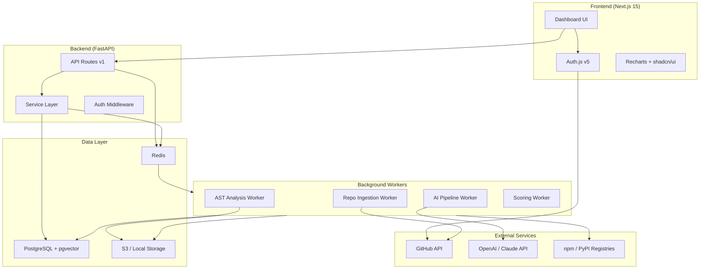

### Architecture Decisions

| Decision | Choice | Rationale |
|----------|--------|-----------|
| **Frontend** | Next.js 15 (App Router) | Server components, API routes as BFF, best DX |
| **Backend** | FastAPI (Python) | Superior AST/ML ecosystem, tree-sitter bindings, fast API dev |
| **Queue** | Redis + ARQ | Lightweight async queue, perfect for MVP (not Celery overhead) |
| **Database** | PostgreSQL + pgvector | Relational + vector search in one DB |
| **Auth** | Auth.js v5 + GitHub OAuth | Zero-friction onboarding, repo access via OAuth token |
| **AI** | Claude 3.5 Sonnet + Haiku | Haiku for bulk analysis ($0.25/M tokens), Sonnet for recommendations |
| **AST** | tree-sitter (Python) | Multi-language, fast, proven in production (VS Code, GitHub) |
| **Storage** | Local filesystem (MVP) → S3 | Temp dir for cloned repos, DB for results |

### Request Flow

```
User → Next.js (SSR + API Routes) → FastAPI Backend → PostgreSQL
                                          ↓
                                    Redis Queue
                                          ↓
                                    Background Worker
                                    ├── Clone Repo
                                    ├── AST Parse (tree-sitter)
                                    ├── Metrics Compute
                                    ├── AI Analysis (Claude API)
                                    ├── Score Calculation
                                    └── Store Results → PostgreSQL
                                          ↓
                                    SSE/Polling → UI Update
```

---

## 2. Folder Structure

```
legacy-modernization-platform/
│
├── frontend/                          # Next.js 15 App
│   ├── app/
│   │   ├── (marketing)/               # Public pages
│   │   │   ├── page.tsx               # Landing page
│   │   │   └── layout.tsx
│   │   ├── (auth)/                    # Auth pages
│   │   │   ├── login/page.tsx
│   │   │   ├── signup/page.tsx
│   │   │   └── layout.tsx
│   │   ├── (dashboard)/               # Protected dashboard
│   │   │   ├── layout.tsx             # Sidebar + header
│   │   │   ├── page.tsx               # Dashboard overview
│   │   │   ├── projects/
│   │   │   │   ├── page.tsx           # Project list
│   │   │   │   ├── new/page.tsx       # New project form
│   │   │   │   └── [id]/
│   │   │   │       ├── page.tsx       # Project overview
│   │   │   │       ├── structure/page.tsx    # Repo tree viz
│   │   │   │       ├── analysis/page.tsx     # Debt analysis
│   │   │   │       ├── dependencies/page.tsx # Dep health
│   │   │   │       ├── recommendations/page.tsx # AI recs
│   │   │   │       └── report/page.tsx       # Full report
│   │   │   └── settings/page.tsx
│   │   ├── api/                       # BFF proxy routes
│   │   │   ├── auth/[...nextauth]/route.ts
│   │   │   └── proxy/[...path]/route.ts
│   │   ├── layout.tsx                 # Root layout
│   │   └── globals.css
│   ├── components/
│   │   ├── ui/                        # shadcn/ui components
│   │   ├── dashboard/
│   │   │   ├── sidebar.tsx
│   │   │   ├── header.tsx
│   │   │   ├── project-card.tsx
│   │   │   └── stats-cards.tsx
│   │   ├── analysis/
│   │   │   ├── score-gauge.tsx        # Modernization score
│   │   │   ├── debt-chart.tsx         # Technical debt viz
│   │   │   ├── dependency-table.tsx
│   │   │   ├── file-tree.tsx          # Repo structure
│   │   │   ├── hotspot-map.tsx        # Code hotspots
│   │   │   └── recommendation-card.tsx
│   │   ├── reports/
│   │   │   ├── report-builder.tsx
│   │   │   └── export-button.tsx
│   │   └── shared/
│   │       ├── loading-skeleton.tsx
│   │       ├── error-boundary.tsx
│   │       └── empty-state.tsx
│   ├── lib/
│   │   ├── api-client.ts              # Typed API client
│   │   ├── auth.ts                    # Auth.js config
│   │   ├── utils.ts                   # Utility functions
│   │   └── constants.ts
│   ├── hooks/
│   │   ├── use-project.ts
│   │   ├── use-analysis.ts
│   │   └── use-polling.ts             # Job status polling
│   ├── types/
│   │   ├── project.ts
│   │   ├── analysis.ts
│   │   └── api.ts
│   ├── next.config.ts
│   ├── tailwind.config.ts
│   ├── tsconfig.json
│   └── package.json
│
├── backend/                           # FastAPI Backend
│   ├── app/
│   │   ├── api/
│   │   │   └── v1/
│   │   │       ├── routes/
│   │   │       │   ├── auth.py        # Auth endpoints
│   │   │       │   ├── projects.py    # CRUD + ingestion trigger
│   │   │       │   ├── analysis.py    # Analysis results
│   │   │       │   ├── recommendations.py  # AI recommendations
│   │   │       │   ├── reports.py     # Report generation
│   │   │       │   └── jobs.py        # Job status
│   │   │       └── router.py         # Route aggregator
│   │   ├── core/
│   │   │   ├── config.py             # Settings (Pydantic)
│   │   │   ├── security.py           # JWT validation
│   │   │   ├── database.py           # SQLAlchemy async
│   │   │   └── redis.py              # Redis connection
│   │   ├── models/                    # SQLAlchemy ORM models
│   │   │   ├── user.py
│   │   │   ├── project.py
│   │   │   ├── analysis.py
│   │   │   ├── recommendation.py
│   │   │   └── job.py
│   │   ├── schemas/                   # Pydantic request/response
│   │   │   ├── user.py
│   │   │   ├── project.py
│   │   │   ├── analysis.py
│   │   │   └── common.py
│   │   ├── services/                  # Business logic
│   │   │   ├── ingestion.py           # Repo clone + inventory
│   │   │   ├── ast_parser.py          # Tree-sitter parsing
│   │   │   ├── metrics.py             # Metric computation
│   │   │   ├── dependency_analyzer.py # Package analysis
│   │   │   ├── ai_pipeline.py         # LLM integration
│   │   │   ├── scoring.py             # Modernization score
│   │   │   └── report_generator.py    # Export reports
│   │   ├── workers/                   # Background tasks
│   │   │   ├── analysis_worker.py     # Main analysis pipeline
│   │   │   └── worker_config.py       # ARQ settings
│   │   └── main.py                    # FastAPI app entry
│   ├── alembic/                       # Database migrations
│   │   ├── versions/
│   │   └── env.py
│   ├── alembic.ini
│   ├── requirements.txt
│   └── pyproject.toml
│
├── docker/
│   ├── Dockerfile.frontend
│   ├── Dockerfile.backend
│   ├── Dockerfile.worker
│   └── docker-compose.yml
│
├── scripts/
│   ├── seed.py                        # Seed demo data
│   ├── demo-repos.json                # Pre-analyzed repos for demo
│   └── setup.sh                       # Dev environment setup
│
├── .github/
│   └── workflows/
│       ├── ci.yml
│       └── deploy.yml
│
├── .env.example
├── README.md
├── LICENSE
└── Makefile                           # Dev shortcuts
```

---

## 3. Database Schema

### Entity Relationship Diagram

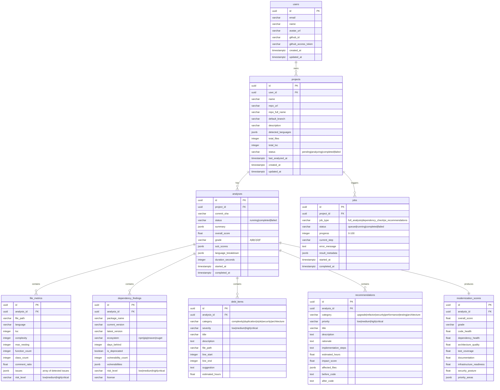

### SQL Migration (Initial)

```sql
-- Enable extensions
CREATE EXTENSION IF NOT EXISTS "uuid-ossp";
CREATE EXTENSION IF NOT EXISTS "vector";

-- Users table
CREATE TABLE users (
    id UUID PRIMARY KEY DEFAULT uuid_generate_v4(),
    email VARCHAR(255) UNIQUE NOT NULL,
    name VARCHAR(255),
    avatar_url TEXT,
    github_id VARCHAR(50) UNIQUE,
    github_access_token TEXT,  -- encrypted at rest
    created_at TIMESTAMPTZ DEFAULT NOW(),
    updated_at TIMESTAMPTZ DEFAULT NOW()
);

-- Projects table
CREATE TABLE projects (
    id UUID PRIMARY KEY DEFAULT uuid_generate_v4(),
    user_id UUID NOT NULL REFERENCES users(id) ON DELETE CASCADE,
    name VARCHAR(255) NOT NULL,
    repo_url TEXT NOT NULL,
    repo_full_name VARCHAR(255),
    default_branch VARCHAR(100) DEFAULT 'main',
    description TEXT,
    detected_languages JSONB DEFAULT '{}',
    total_files INTEGER DEFAULT 0,
    total_loc INTEGER DEFAULT 0,
    status VARCHAR(20) DEFAULT 'pending',
    last_analyzed_at TIMESTAMPTZ,
    created_at TIMESTAMPTZ DEFAULT NOW(),
    updated_at TIMESTAMPTZ DEFAULT NOW()
);

-- Analyses table
CREATE TABLE analyses (
    id UUID PRIMARY KEY DEFAULT uuid_generate_v4(),
    project_id UUID NOT NULL REFERENCES projects(id) ON DELETE CASCADE,
    commit_sha VARCHAR(40),
    status VARCHAR(20) DEFAULT 'running',
    summary JSONB,
    overall_score FLOAT,
    grade VARCHAR(2),
    sub_scores JSONB,
    language_breakdown JSONB,
    duration_seconds INTEGER,
    started_at TIMESTAMPTZ DEFAULT NOW(),
    completed_at TIMESTAMPTZ
);

-- File metrics
CREATE TABLE file_metrics (
    id UUID PRIMARY KEY DEFAULT uuid_generate_v4(),
    analysis_id UUID NOT NULL REFERENCES analyses(id) ON DELETE CASCADE,
    file_path TEXT NOT NULL,
    language VARCHAR(50),
    loc INTEGER DEFAULT 0,
    complexity INTEGER DEFAULT 0,
    max_nesting INTEGER DEFAULT 0,
    function_count INTEGER DEFAULT 0,
    class_count INTEGER DEFAULT 0,
    comment_ratio FLOAT DEFAULT 0,
    issues JSONB DEFAULT '[]',
    risk_level VARCHAR(10) DEFAULT 'low'
);

-- Dependencies
CREATE TABLE dependency_findings (
    id UUID PRIMARY KEY DEFAULT uuid_generate_v4(),
    analysis_id UUID NOT NULL REFERENCES analyses(id) ON DELETE CASCADE,
    package_name VARCHAR(255) NOT NULL,
    current_version VARCHAR(50),
    latest_version VARCHAR(50),
    ecosystem VARCHAR(20),
    days_behind INTEGER DEFAULT 0,
    is_deprecated BOOLEAN DEFAULT FALSE,
    vulnerability_count INTEGER DEFAULT 0,
    vulnerabilities JSONB DEFAULT '[]',
    risk_level VARCHAR(10) DEFAULT 'low',
    license VARCHAR(100)
);

-- Technical debt items
CREATE TABLE debt_items (
    id UUID PRIMARY KEY DEFAULT uuid_generate_v4(),
    analysis_id UUID NOT NULL REFERENCES analyses(id) ON DELETE CASCADE,
    category VARCHAR(30) NOT NULL,
    severity VARCHAR(10) NOT NULL,
    title VARCHAR(500) NOT NULL,
    description TEXT,
    file_path TEXT,
    line_start INTEGER,
    line_end INTEGER,
    suggestion TEXT,
    estimated_hours FLOAT
);

-- AI Recommendations
CREATE TABLE recommendations (
    id UUID PRIMARY KEY DEFAULT uuid_generate_v4(),
    analysis_id UUID NOT NULL REFERENCES analyses(id) ON DELETE CASCADE,
    category VARCHAR(30) NOT NULL,
    priority VARCHAR(10) NOT NULL,
    title VARCHAR(500) NOT NULL,
    description TEXT,
    rationale TEXT,
    implementation_steps TEXT,
    estimated_hours FLOAT,
    impact_score FLOAT,
    affected_files JSONB DEFAULT '[]',
    before_code TEXT,
    after_code TEXT
);

-- Modernization scores
CREATE TABLE modernization_scores (
    id UUID PRIMARY KEY DEFAULT uuid_generate_v4(),
    analysis_id UUID UNIQUE NOT NULL REFERENCES analyses(id) ON DELETE CASCADE,
    overall_score FLOAT NOT NULL,
    grade VARCHAR(2) NOT NULL,
    code_health FLOAT,
    dependency_health FLOAT,
    architecture_quality FLOAT,
    test_coverage FLOAT,
    documentation FLOAT,
    infrastructure_readiness FLOAT,
    security_posture FLOAT,
    priority_areas JSONB DEFAULT '[]'
);

-- Background jobs
CREATE TABLE jobs (
    id UUID PRIMARY KEY DEFAULT uuid_generate_v4(),
    project_id UUID NOT NULL REFERENCES projects(id) ON DELETE CASCADE,
    job_type VARCHAR(30) NOT NULL,
    status VARCHAR(20) DEFAULT 'queued',
    progress INTEGER DEFAULT 0,
    current_step VARCHAR(255),
    error_message TEXT,
    result_metadata JSONB,
    started_at TIMESTAMPTZ,
    completed_at TIMESTAMPTZ
);

-- Indexes
CREATE INDEX idx_projects_user_id ON projects(user_id);
CREATE INDEX idx_analyses_project_id ON analyses(project_id);
CREATE INDEX idx_file_metrics_analysis_id ON file_metrics(analysis_id);
CREATE INDEX idx_debt_items_analysis_id ON debt_items(analysis_id);
CREATE INDEX idx_recommendations_analysis_id ON recommendations(analysis_id);
CREATE INDEX idx_jobs_project_id ON jobs(project_id);
CREATE INDEX idx_jobs_status ON jobs(status);
```

---

## 4. API Design

### API Contract — RESTful Endpoints

#### Base URL: `/api/v1`

---

#### Authentication

| Method | Endpoint | Description |
|--------|----------|-------------|
| `POST` | `/auth/github/callback` | GitHub OAuth callback |
| `GET` | `/auth/me` | Get current user profile |
| `POST` | `/auth/logout` | Logout / invalidate session |

---

#### Projects

| Method | Endpoint | Description |
|--------|----------|-------------|
| `GET` | `/projects` | List user's projects |
| `POST` | `/projects` | Create project (triggers ingestion) |
| `GET` | `/projects/:id` | Get project details |
| `DELETE` | `/projects/:id` | Delete project and all data |
| `POST` | `/projects/:id/analyze` | Re-trigger full analysis |

**Request: `POST /projects`**
```json
{
  "repo_url": "https://github.com/user/repo",
  "name": "My Legacy App"
}
```

**Response: `201 Created`**
```json
{
  "id": "uuid",
  "name": "My Legacy App",
  "repo_url": "https://github.com/user/repo",
  "status": "analyzing",
  "job_id": "uuid",
  "created_at": "2026-05-21T00:00:00Z"
}
```

---

#### Analysis Results

| Method | Endpoint | Description |
|--------|----------|-------------|
| `GET` | `/projects/:id/analysis` | Get latest analysis summary |
| `GET` | `/projects/:id/analysis/score` | Modernization readiness score |
| `GET` | `/projects/:id/analysis/files` | File-level metrics (paginated) |
| `GET` | `/projects/:id/analysis/files/:path` | Single file deep analysis |
| `GET` | `/projects/:id/analysis/debt` | Technical debt items |
| `GET` | `/projects/:id/analysis/dependencies` | Dependency health |
| `GET` | `/projects/:id/analysis/structure` | Repository file tree |

**Response: `GET /projects/:id/analysis/score`**
```json
{
  "overall_score": 42.5,
  "grade": "C",
  "sub_scores": {
    "code_health": 55,
    "dependency_health": 30,
    "architecture_quality": 45,
    "test_coverage": 20,
    "documentation": 60,
    "infrastructure_readiness": 50,
    "security_posture": 70
  },
  "priority_areas": [
    { "area": "dependency_health", "score": 30, "action": "Update 12 outdated packages" },
    { "area": "test_coverage", "score": 20, "action": "Add unit tests (0% coverage detected)" }
  ]
}
```

---

#### AI Recommendations

| Method | Endpoint | Description |
|--------|----------|-------------|
| `GET` | `/projects/:id/recommendations` | All AI recommendations |
| `GET` | `/projects/:id/recommendations/:rec_id` | Single recommendation detail |
| `POST` | `/projects/:id/recommendations/:rec_id/refactor` | Get AI refactoring code |

**Response: `GET /projects/:id/recommendations`**
```json
{
  "recommendations": [
    {
      "id": "uuid",
      "category": "upgrade",
      "priority": "critical",
      "title": "Upgrade React from v16 to v19",
      "description": "React 16 reached EOL...",
      "rationale": "Security patches, performance...",
      "implementation_steps": "1. Update package.json...",
      "estimated_hours": 24,
      "impact_score": 9.2,
      "affected_files": ["src/App.js", "src/index.js"],
      "before_code": "class App extends Component {...}",
      "after_code": "function App() {...}"
    }
  ]
}
```

---

#### Reports

| Method | Endpoint | Description |
|--------|----------|-------------|
| `GET` | `/projects/:id/report` | Get full report data |
| `GET` | `/projects/:id/report/export?format=pdf` | Export as PDF |
| `GET` | `/projects/:id/report/export?format=json` | Export as JSON |

---

#### Job Status

| Method | Endpoint | Description |
|--------|----------|-------------|
| `GET` | `/jobs/:id` | Get job status + progress |
| `GET` | `/projects/:id/jobs` | All jobs for a project |

**Response: `GET /jobs/:id`**
```json
{
  "id": "uuid",
  "status": "running",
  "progress": 65,
  "current_step": "AI analysis in progress",
  "steps": [
    { "name": "Cloning repository", "status": "completed" },
    { "name": "Parsing source files", "status": "completed" },
    { "name": "Computing metrics", "status": "completed" },
    { "name": "AI analysis", "status": "running" },
    { "name": "Generating recommendations", "status": "pending" },
    { "name": "Calculating score", "status": "pending" }
  ]
}
```

---

## 5. Repository Ingestion Pipeline

### Pipeline Architecture

```mermaid
flowchart LR
    A["API: POST /projects"] --> B["Validate URL"]
    B --> C["Create Project Record"]
    C --> D["Enqueue Job"]
    D --> E["Worker: Clone Repo"]
    E --> F["Build File Inventory"]
    F --> G["Detect Languages"]
    G --> H["Parse Manifests"]
    H --> I["Update Project Metadata"]
    I --> J["Trigger Analysis Pipeline"]
```

### Ingestion Worker Logic

```python
async def ingest_repository(ctx, project_id: str):
    """
    Pipeline: Clone → Inventory → Language Detection → Manifest Parsing
    """
    job = await update_job(project_id, progress=0, step="Cloning repository")
    
    project = await get_project(project_id)
    user = await get_user(project.user_id)
    
    with tempfile.TemporaryDirectory() as tmpdir:
        # 1. Shallow clone
        clone_url = inject_token(project.repo_url, user.github_access_token)
        await git_clone(clone_url, tmpdir, depth=1, timeout=120)
        await update_job(project_id, progress=15, step="Cloning complete")
        
        # 2. Build inventory
        inventory = walk_repository(tmpdir)
        await update_job(project_id, progress=25, step="Scanning files")
        
        # 3. Detect languages
        languages = detect_languages(inventory)
        
        # 4. Parse package manifests
        manifests = parse_manifests(tmpdir)  # package.json, requirements.txt, pom.xml, etc.
        
        # 5. Update project record
        await update_project(project_id, {
            'detected_languages': languages,
            'total_files': inventory['total_files'],
            'total_loc': inventory['total_loc'],
        })
        
        # 6. Trigger analysis pipeline (next worker stage)
        await enqueue_analysis(project_id, tmpdir, inventory, manifests)
```

### Supported Manifest Files

| File | Ecosystem | Parsed For |
|------|-----------|------------|
| `package.json` | npm | dependencies, devDependencies, engines |
| `package-lock.json` | npm | exact versions, transitive deps |
| `requirements.txt` | pip | pinned versions |
| `pyproject.toml` | pip/poetry | dependencies, build system |
| `Pipfile` / `Pipfile.lock` | pipenv | dependencies |
| `pom.xml` | Maven | Java dependencies |
| `build.gradle` | Gradle | Java/Kotlin dependencies |
| `Gemfile` | Bundler | Ruby dependencies |
| `go.mod` | Go modules | Go dependencies |
| `Cargo.toml` | Cargo | Rust dependencies |
| `.csproj` | NuGet | .NET dependencies |

### Safety Limits

| Limit | Value | Rationale |
|-------|-------|-----------|
| Max repo size | 500 MB | Prevent abuse |
| Clone timeout | 120 seconds | Network reliability |
| Max files to parse | 5,000 | Performance |
| Max file size | 1 MB per file | Skip minified/generated |
| Excluded dirs | `node_modules`, `.git`, `dist`, `build`, `vendor`, `__pycache__` | Noise reduction |

---

## 6. AI Pipeline Architecture

### Two-Tier AI Strategy

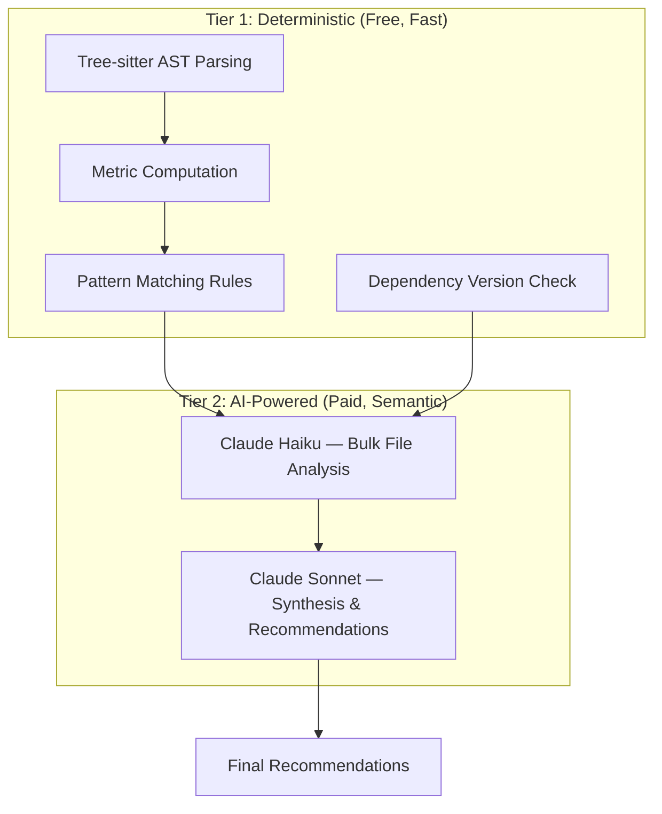

> [!IMPORTANT]
> **Cost-conscious design**: 80% of analysis is deterministic (tree-sitter + rules), only 20% uses paid LLM APIs. This keeps per-repo analysis cost to **$0.50–$5.00**.

### AI Pipeline Steps

| Step | Tool | Purpose | Cost |
|------|------|---------|------|
| 1. AST Parse | tree-sitter | Extract structure, functions, classes | Free |
| 2. Metrics | Python | Complexity, LOC, nesting, coupling | Free |
| 3. Dep Check | Registry APIs | Version comparison, CVE lookup | Free |
| 4. Pattern Match | Rule engine | Known anti-patterns, smells | Free |
| 5. File Analysis | Claude Haiku | Semantic debt detection per file | ~$0.10/repo |
| 6. Synthesis | Claude Sonnet | Cross-file insights, recommendations | ~$0.50/repo |
| 7. Refactoring | Claude Sonnet | On-demand code suggestions | ~$0.10/request |

### Prompt Strategy

**File-Level Analysis (Haiku — batched):**
```
Analyze this {language} file for technical debt and modernization opportunities.
File: {file_path}
Existing metrics: complexity={complexity}, loc={loc}, nesting={nesting}

Identify:
1. Anti-patterns (with severity)
2. Security concerns
3. Modernization opportunities
4. Deprecated API usage

Respond in JSON: {"issues": [...], "opportunities": [...]}
```

**Repository Synthesis (Sonnet — single call):**
```
You are a senior application modernization architect.

Repository: {repo_name}
Languages: {languages}
Total Files: {total_files}, LOC: {total_loc}
Framework: {detected_framework}

Quantitative analysis results:
{metrics_summary_json}

Top file-level issues:
{top_issues_json}

Dependency findings:
{dependency_summary_json}

Generate a comprehensive modernization plan with:
1. Executive summary (2-3 sentences)
2. Top 10 prioritized recommendations with category, effort, and impact
3. Suggested migration path (if framework upgrade needed)
4. Quick wins (< 4 hours effort)
5. Strategic improvements (> 1 week effort)

Respond in JSON format.
```

---

## 7. AST Analysis Strategy

### Language Support Matrix (MVP)

| Language | tree-sitter Grammar | Priority | Extraction |
|----------|-------------------|----------|------------|
| JavaScript | `tree-sitter-javascript` | P0 | Functions, classes, imports, JSX |
| TypeScript | `tree-sitter-typescript` | P0 | Functions, classes, imports, types, interfaces |
| Python | `tree-sitter-python` | P0 | Functions, classes, imports, decorators |
| Java | `tree-sitter-java` | P1 | Classes, methods, imports, annotations |
| Go | `tree-sitter-go` | P2 | Functions, structs, imports |
| Ruby | `tree-sitter-ruby` | P2 | Methods, classes, modules |

### AST Extraction Targets

```python
@dataclass
class FileAnalysis:
    file_path: str
    language: str
    loc: int
    blank_lines: int
    comment_lines: int
    
    # Structural
    functions: list[FunctionInfo]
    classes: list[ClassInfo]
    imports: list[ImportInfo]
    
    # Metrics
    cyclomatic_complexity: int
    cognitive_complexity: int
    max_nesting_depth: int
    
    # Issues
    long_functions: list[str]     # > 60 LOC
    complex_functions: list[str]  # complexity > 10
    deep_nesting: list[str]       # > 4 levels
    god_classes: list[str]        # > 20 methods
    too_many_params: list[str]    # > 5 params

@dataclass
class FunctionInfo:
    name: str
    start_line: int
    end_line: int
    params: list[str]
    loc: int
    complexity: int
    nesting_depth: int
    is_async: bool
    has_docstring: bool

@dataclass
class ClassInfo:
    name: str
    start_line: int
    end_line: int
    method_count: int
    inheritance: list[str]
    loc: int

@dataclass
class ImportInfo:
    module: str
    names: list[str]
    is_relative: bool
    line: int
```

### Complexity Calculation

```python
def calculate_cyclomatic_complexity(node, language: str) -> int:
    """Count decision points for cyclomatic complexity"""
    DECISION_NODES = {
        'python': {'if_statement', 'elif_clause', 'for_statement',
                   'while_statement', 'except_clause', 'with_statement',
                   'boolean_operator', 'conditional_expression'},
        'javascript': {'if_statement', 'for_statement', 'for_in_statement',
                       'while_statement', 'do_statement', 'switch_case',
                       'catch_clause', 'ternary_expression',
                       'binary_expression'},  # && and ||
        'typescript': {...},  # same as JS + type guards
    }
    
    count = 1  # Base path
    decisions = DECISION_NODES.get(language, set())
    
    def walk(n):
        nonlocal count
        if n.type in decisions:
            count += 1
        for child in n.children:
            walk(child)
    
    walk(node)
    return count
```

---

## 8. Technical Debt Detection Logic

### Detection Rule Engine

```python
DEBT_RULES = [
    # Code Complexity
    {
        "id": "COMPLEXITY_HIGH",
        "category": "complexity",
        "check": lambda f: f.complexity > 10,
        "severity": "high",
        "title": "High cyclomatic complexity ({complexity})",
        "suggestion": "Break this function into smaller, focused functions"
    },
    {
        "id": "COMPLEXITY_CRITICAL",
        "category": "complexity",
        "check": lambda f: f.complexity > 20,
        "severity": "critical",
        "title": "Critical cyclomatic complexity ({complexity})",
        "suggestion": "Urgent refactoring needed — extract methods or use strategy pattern"
    },
    
    # Function Size
    {
        "id": "LONG_FUNCTION",
        "category": "complexity",
        "check": lambda f: f.loc > 60,
        "severity": "medium",
        "title": "Long function ({loc} lines)",
        "suggestion": "Functions should be < 60 lines. Extract helper functions."
    },
    {
        "id": "VERY_LONG_FUNCTION",
        "category": "complexity",
        "check": lambda f: f.loc > 150,
        "severity": "high",
        "title": "Very long function ({loc} lines)",
        "suggestion": "This function is extremely long. Apply SRP and extract methods."
    },
    
    # Nesting
    {
        "id": "DEEP_NESTING",
        "category": "complexity",
        "check": lambda f: f.max_nesting > 4,
        "severity": "medium",
        "title": "Deeply nested code ({nesting} levels)",
        "suggestion": "Use early returns, extract conditions, or apply guard clauses"
    },
    
    # Parameters
    {
        "id": "TOO_MANY_PARAMS",
        "category": "style",
        "check": lambda f: len(f.params) > 5,
        "severity": "medium",
        "title": "Too many parameters ({param_count})",
        "suggestion": "Use a configuration object or data class instead"
    },
    
    # God Classes
    {
        "id": "GOD_CLASS",
        "category": "architecture",
        "check": lambda c: c.method_count > 20,
        "severity": "high",
        "title": "God class with {method_count} methods",
        "suggestion": "Split into smaller, focused classes following SRP"
    },
    
    # File Size
    {
        "id": "LARGE_FILE",
        "category": "architecture",
        "check": lambda file: file.loc > 500,
        "severity": "medium",
        "title": "Large file ({loc} lines)",
        "suggestion": "Consider splitting into multiple modules"
    },
    
    # Missing Documentation
    {
        "id": "NO_DOCSTRING",
        "category": "documentation",
        "check": lambda f: not f.has_docstring and f.loc > 10,
        "severity": "low",
        "title": "Public function missing documentation",
        "suggestion": "Add a docstring describing purpose, params, and return value"
    },
]
```

### Dependency Risk Detection

```python
async def analyze_dependency_risk(package_name: str, current_version: str, ecosystem: str):
    """Check a single dependency for risks"""
    
    # 1. Get latest version from registry
    latest = await fetch_latest_version(package_name, ecosystem)
    
    # 2. Calculate version lag
    days_behind = calculate_days_behind(current_version, latest)
    
    # 3. Check for known vulnerabilities (GitHub Advisory Database)
    vulns = await check_github_advisories(package_name, current_version, ecosystem)
    
    # 4. Check if deprecated
    is_deprecated = await check_deprecation(package_name, ecosystem)
    
    # 5. Assign risk level
    risk = "low"
    if days_behind > 365 or len(vulns) > 0:
        risk = "medium"
    if days_behind > 730 or len(vulns) > 2 or is_deprecated:
        risk = "high"
    if len([v for v in vulns if v['severity'] == 'critical']) > 0:
        risk = "critical"
    
    return DependencyFinding(
        package_name=package_name,
        current_version=current_version,
        latest_version=latest['version'],
        days_behind=days_behind,
        is_deprecated=is_deprecated,
        vulnerability_count=len(vulns),
        vulnerabilities=vulns,
        risk_level=risk,
        license=latest.get('license'),
    )
```

### Pattern Detection Categories

| Category | Detection Method | Examples |
|----------|-----------------|----------|
| **Complexity** | AST + metrics | High complexity, deep nesting, long methods |
| **Duplication** | Heuristic (similar function signatures) | Copy-paste code |
| **Style** | AST pattern matching | Inconsistent naming, too many params |
| **Security** | Regex + AST | Hardcoded secrets, SQL concatenation, eval() |
| **Architecture** | Import graph analysis | Circular deps, god classes, tight coupling |
| **Deprecated APIs** | LLM semantic analysis | Outdated library usage, legacy patterns |

---

## 9. Modernization Scoring System

### Score Dimensions

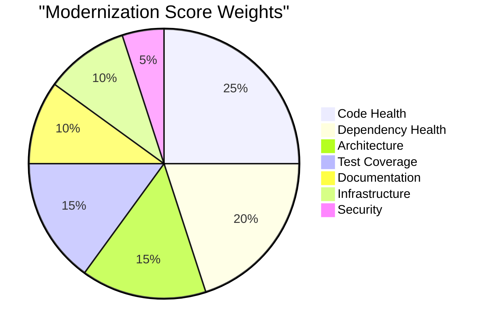

### Scoring Algorithm

```python
def calculate_modernization_score(metrics: AnalysisMetrics) -> ModernizationScore:
    """
    Calculate 0-100 modernization readiness score with letter grade.
    Higher = more modern/ready.
    """
    
    # --- Code Health (25%) ---
    avg_complexity = metrics.avg_cyclomatic_complexity
    long_method_ratio = metrics.long_methods / max(metrics.total_methods, 1)
    large_file_ratio = metrics.large_files / max(metrics.total_files, 1)
    
    code_health = clamp(0, 100,
        100
        - (avg_complexity * 5)        # -5 pts per avg complexity unit
        - (long_method_ratio * 50)     # -50 if all methods are long
        - (large_file_ratio * 30)      # -30 if all files are large
    )
    
    # --- Dependency Health (20%) ---
    outdated_ratio = metrics.outdated_deps / max(metrics.total_deps, 1)
    vuln_count = metrics.vulnerability_count
    deprecated_count = metrics.deprecated_deps
    
    dependency_health = clamp(0, 100,
        100
        - (outdated_ratio * 60)        # -60 if all deps outdated
        - (vuln_count * 8)             # -8 per vulnerability
        - (deprecated_count * 15)      # -15 per deprecated package
    )
    
    # --- Architecture Quality (15%) ---
    avg_coupling = metrics.avg_imports_per_file
    circular_dep_count = metrics.circular_dependencies
    
    architecture = clamp(0, 100,
        100
        - (max(0, avg_coupling - 5) * 5)  # Penalty above 5 imports
        - (circular_dep_count * 20)         # -20 per circular dep
    )
    
    # --- Test Coverage (15%) ---
    has_tests = metrics.test_file_count > 0
    test_ratio = metrics.test_file_count / max(metrics.source_file_count, 1)
    has_test_config = metrics.has_test_config  # jest.config, pytest.ini, etc.
    
    test_coverage = clamp(0, 100,
        (min(100, test_ratio * 200) if has_tests else 0)
        + (10 if has_test_config else 0)
    )
    
    # --- Documentation (10%) ---
    has_readme = metrics.has_readme
    readme_quality = metrics.readme_loc / 50  # Normalize to 0-1 scale
    comment_ratio = metrics.overall_comment_ratio
    
    documentation = clamp(0, 100,
        (40 if has_readme else 0)
        + (min(30, readme_quality * 30))
        + (min(30, comment_ratio * 300))
    )
    
    # --- Infrastructure Readiness (10%) ---
    has_docker = metrics.has_dockerfile
    has_ci = metrics.has_ci_config
    has_env_example = metrics.has_env_example
    has_linter = metrics.has_linter_config
    
    infrastructure = (
        (30 if has_docker else 0)
        + (30 if has_ci else 0)
        + (20 if has_env_example else 0)
        + (20 if has_linter else 0)
    )
    
    # --- Security Posture (5%) ---
    secrets_found = metrics.potential_secrets_count
    security_vulns = metrics.security_vulnerability_count
    
    security = clamp(0, 100,
        100
        - (secrets_found * 25)
        - (security_vulns * 15)
    )
    
    # --- Weighted Total ---
    weights = {
        'code_health': 0.25,
        'dependency_health': 0.20,
        'architecture_quality': 0.15,
        'test_coverage': 0.15,
        'documentation': 0.10,
        'infrastructure_readiness': 0.10,
        'security_posture': 0.05,
    }
    
    sub_scores = {
        'code_health': round(code_health, 1),
        'dependency_health': round(dependency_health, 1),
        'architecture_quality': round(architecture, 1),
        'test_coverage': round(test_coverage, 1),
        'documentation': round(documentation, 1),
        'infrastructure_readiness': round(infrastructure, 1),
        'security_posture': round(security, 1),
    }
    
    overall = sum(sub_scores[k] * weights[k] for k in weights)
    grade = (
        'A' if overall >= 80 else
        'B' if overall >= 60 else
        'C' if overall >= 40 else
        'D' if overall >= 20 else
        'F'
    )
    
    # Identify priority areas (lowest scoring)
    priority_areas = sorted(
        [{'area': k, 'score': v} for k, v in sub_scores.items()],
        key=lambda x: x['score']
    )[:3]
    
    return ModernizationScore(
        overall_score=round(overall, 1),
        grade=grade,
        sub_scores=sub_scores,
        priority_areas=priority_areas,
    )
```

### Grade Interpretation (for UI)

| Grade | Score | Label | Color |
|-------|-------|-------|-------|
| **A** | 80-100 | Modernization Ready | `#22c55e` (green) |
| **B** | 60-79 | Good Foundation | `#84cc16` (lime) |
| **C** | 40-59 | Needs Attention | `#eab308` (yellow) |
| **D** | 20-39 | Significant Debt | `#f97316` (orange) |
| **F** | 0-19 | Critical Modernization Needed | `#ef4444` (red) |

---

## 10. Refactoring Recommendation Workflow

### Workflow

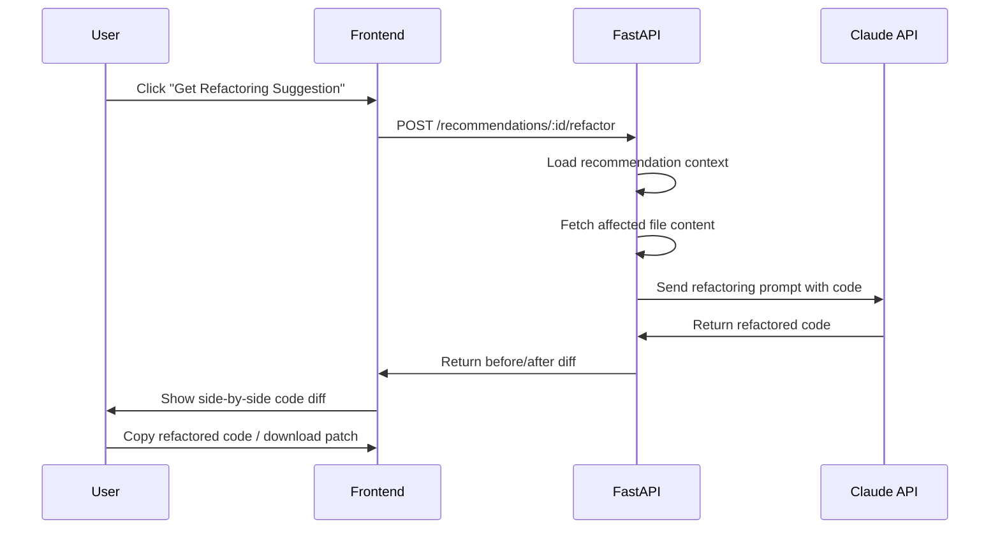

### On-Demand Refactoring Prompt

```
You are a senior software engineer performing a code refactoring.

Context:
- Recommendation: {recommendation_title}
- Rationale: {recommendation_rationale}
- Language: {language}
- File: {file_path}

Original code:
```{language}
{original_code}
```

Refactor this code to address the recommendation. Rules:
1. Preserve all existing functionality
2. Maintain the same API/interface
3. Follow {language} best practices and modern idioms
4. Add appropriate comments explaining changes
5. Keep the refactored code production-ready

Return ONLY the refactored code, no explanations.
```

### Recommendation Categories (Prioritized)

| Priority | Category | Example |
|----------|----------|---------|
| **Critical** | Security | Fix SQL injection, remove hardcoded secrets |
| **Critical** | Vulnerability | Update package with known CVE |
| **High** | Upgrade | Framework major version upgrade path |
| **High** | Refactor | Break up god class, reduce complexity |
| **Medium** | Performance | Replace N+1 queries, add caching |
| **Medium** | Architecture | Extract shared modules, reduce coupling |
| **Low** | Testing | Add unit tests for critical paths |
| **Low** | Documentation | Add JSDoc/docstrings, improve README |

---

## 11. Dashboard UI Structure

### Page Map

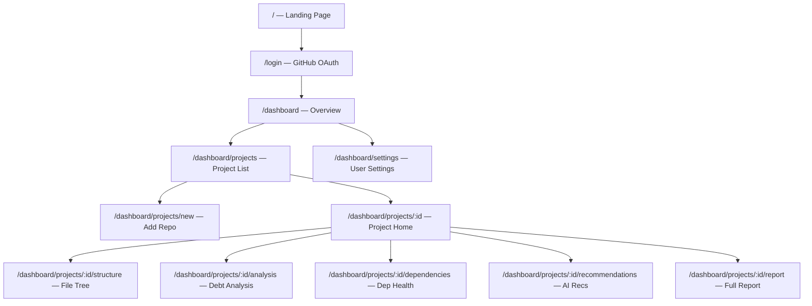

### Dashboard Overview (`/dashboard`)

```
┌──────────────────────────────────────────────────────────────┐
│  🔬 CodeLens AI                        [User Avatar] [⚙️]    │
├──────────┬───────────────────────────────────────────────────┤
│          │                                                    │
│ Overview │  Welcome back, Nilu                                │
│          │                                                    │
│ Projects │  ┌─────────┐ ┌─────────┐ ┌─────────┐ ┌─────────┐ │
│          │  │ Total   │ │ Avg     │ │ Critical│ │ Repos   │ │
│ Settings │  │ Projects│ │ Score   │ │ Issues  │ │ Analyzed│ │
│          │  │   4     │ │  C (42) │ │   23    │ │    3    │ │
│          │  └─────────┘ └─────────┘ └─────────┘ └─────────┘ │
│          │                                                    │
│          │  Recent Projects                     [+ New Repo]  │
│          │  ┌───────────────────────────────────────────────┐ │
│          │  │ 📦 legacy-api       Score: D (35)  ● 12 issues│ │
│          │  │ 📦 frontend-app     Score: B (72)  ● 3 issues │ │
│          │  │ 📦 payment-service  Score: C (48)  ● 8 issues │ │
│          │  └───────────────────────────────────────────────┘ │
│          │                                                    │
│          │  Score Distribution          Language Breakdown    │
│          │  ┌──────────────────┐       ┌──────────────────┐  │
│          │  │   [Bar Chart]    │       │   [Pie Chart]    │  │
│          │  └──────────────────┘       └──────────────────┘  │
└──────────┴───────────────────────────────────────────────────┘
```

### Project Detail — Score Tab (`/dashboard/projects/:id`)

```
┌───────────────────────────────────────────────────────────────┐
│  ← Projects / legacy-api                                      │
│                                                                │
│  ┌─────────────────────────────────────────────────────────┐  │
│  │                                                         │  │
│  │   ┌──────────────┐    Modernization Readiness Score     │  │
│  │   │              │                                      │  │
│  │   │    ████      │    Grade: D (35/100)                 │  │
│  │   │   █ 35 █     │    "Significant Technical Debt"      │  │
│  │   │    ████      │                                      │  │
│  │   │  [Gauge]     │    Last analyzed: 2 hours ago        │  │
│  │   └──────────────┘    Commit: abc1234                   │  │
│  │                                                         │  │
│  └─────────────────────────────────────────────────────────┘  │
│                                                                │
│  [Overview] [Structure] [Analysis] [Dependencies] [AI Recs]   │
│                                                                │
│  ┌────────────────────────┐  ┌──────────────────────────────┐ │
│  │   Sub-Score Radar      │  │  Priority Areas              │ │
│  │   ┌────────────────┐   │  │                              │ │
│  │   │  [Radar Chart]  │  │  │  ⚠️ Test Coverage: 15/100    │ │
│  │   │  Code Health    │  │  │  ⚠️ Dependencies: 25/100     │ │
│  │   │  Dependencies   │  │  │  ⚠️ Security: 40/100        │ │
│  │   │  Architecture   │  │  │                              │ │
│  │   │  Tests          │  │  │  [View Recommendations →]    │ │
│  │   │  Docs           │  │  │                              │ │
│  │   └────────────────┘   │  └──────────────────────────────┘ │
│  └────────────────────────┘                                    │
│                                                                │
│  Quick Stats                                                   │
│  ┌──────────┬───────────┬───────────┬──────────┬────────────┐ │
│  │ 342 files│ 28K LOC   │ 47 issues │ 12 deps  │ 3 critical │ │
│  │          │           │           │ outdated │ vulns      │ │
│  └──────────┴───────────┴───────────┴──────────┴────────────┘ │
└───────────────────────────────────────────────────────────────┘
```

### Key UI Components

| Component | Library | Purpose |
|-----------|---------|---------|
| Score Gauge | Custom SVG + CSS animation | Animated score circle |
| Radar Chart | Recharts `RadarChart` | Sub-score visualization |
| File Tree | Custom recursive component | Repository structure |
| Code Diff | `react-diff-viewer-continued` | Before/after refactoring |
| Data Tables | shadcn/ui `Table` + `tanstack/react-table` | File metrics, dependencies |
| Progress Bar | shadcn/ui `Progress` | Job progress tracking |
| Skeleton | shadcn/ui `Skeleton` | Loading states |
| Toasts | shadcn/ui `Sonner` | Notifications |
| Command Palette | shadcn/ui `Command` | Quick navigation (Cmd+K) |

---

## 12. Authentication Flow

### Flow Diagram

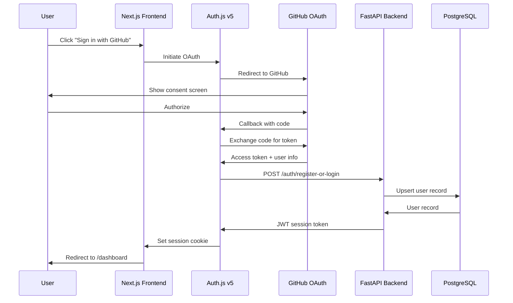

### Auth Configuration

```typescript
// frontend/lib/auth.ts
import NextAuth from "next-auth"
import GitHub from "next-auth/providers/github"

export const { handlers, auth, signIn, signOut } = NextAuth({
  providers: [
    GitHub({
      clientId: process.env.GITHUB_CLIENT_ID!,
      clientSecret: process.env.GITHUB_CLIENT_SECRET!,
      authorization: {
        params: {
          // Request repo read access for code analysis
          scope: "read:user user:email repo",
        },
      },
    }),
  ],
  callbacks: {
    async jwt({ token, account, profile }) {
      if (account) {
        // Store GitHub access token for repo cloning
        token.accessToken = account.access_token
        token.githubId = profile?.id
        
        // Register/update user in backend
        await fetch(`${process.env.BACKEND_URL}/api/v1/auth/sync`, {
          method: "POST",
          headers: { "Content-Type": "application/json" },
          body: JSON.stringify({
            github_id: profile?.id,
            email: profile?.email,
            name: profile?.name,
            avatar_url: profile?.avatar_url,
            access_token: account.access_token,
          }),
        })
      }
      return token
    },
    async session({ session, token }) {
      session.accessToken = token.accessToken as string
      return session
    },
  },
})
```

### Route Protection

```typescript
// frontend/middleware.ts
import { auth } from "./lib/auth"

export default auth((req) => {
  const isLoggedIn = !!req.auth
  const isOnDashboard = req.nextUrl.pathname.startsWith("/dashboard")
  const isOnAuth = req.nextUrl.pathname.startsWith("/login")

  if (isOnDashboard && !isLoggedIn) {
    return Response.redirect(new URL("/login", req.nextUrl))
  }

  if (isOnAuth && isLoggedIn) {
    return Response.redirect(new URL("/dashboard", req.nextUrl))
  }
})

export const config = {
  matcher: ["/dashboard/:path*", "/login"],
}
```

### GitHub OAuth Scopes

| Scope | Purpose |
|-------|---------|
| `read:user` | Access user profile |
| `user:email` | Access user email |
| `repo` | Read access to public + private repos |

> [!WARNING]
> The `repo` scope grants write access too. For the MVP this is acceptable for simplicity. In production, use GitHub Apps with fine-grained permissions (read-only `contents` permission).

---

## 13. Background Job Architecture

### Architecture

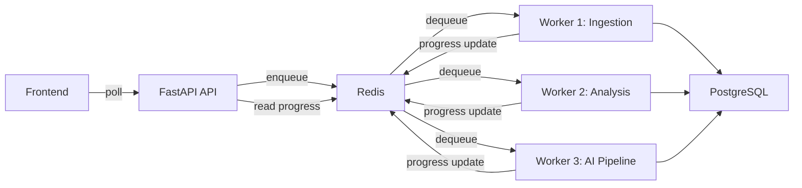

### ARQ Worker Configuration

```python
# backend/app/workers/worker_config.py
from arq import cron
from arq.connections import RedisSettings

from app.workers.analysis_worker import (
    run_full_analysis,
    run_dependency_check,
    run_ai_recommendations,
)

class WorkerSettings:
    """ARQ worker configuration"""
    
    functions = [
        run_full_analysis,
        run_dependency_check,
        run_ai_recommendations,
    ]
    
    redis_settings = RedisSettings(
        host='localhost',
        port=6379,
        database=0,
    )
    
    # Concurrency
    max_jobs = 3              # Max simultaneous jobs
    job_timeout = 600         # 10 min per job
    max_tries = 2             # Retry once on failure
    
    # Health
    health_check_interval = 30
    
    # Graceful shutdown
    allow_abort_jobs = True
```

### Job Progress Tracking

```python
# backend/app/services/job_tracker.py
import json
from app.core.redis import redis_client

async def update_job_progress(
    job_id: str,
    progress: int,
    current_step: str,
    status: str = "running"
):
    """Update job progress in Redis (for real-time polling)"""
    await redis_client.hset(f"job:{job_id}", mapping={
        "progress": progress,
        "current_step": current_step,
        "status": status,
        "updated_at": datetime.utcnow().isoformat(),
    })
    
    # Also update PostgreSQL for persistence
    await db.execute(
        update(Job)
        .where(Job.id == job_id)
        .values(progress=progress, current_step=current_step, status=status)
    )

async def get_job_progress(job_id: str) -> dict:
    """Get current job progress from Redis"""
    data = await redis_client.hgetall(f"job:{job_id}")
    if not data:
        # Fallback to DB
        return await get_job_from_db(job_id)
    return data
```

### Frontend Polling

```typescript
// frontend/hooks/use-job-status.ts
import { useEffect, useState } from 'react'

export function useJobStatus(jobId: string | null) {
  const [status, setStatus] = useState<JobStatus | null>(null)

  useEffect(() => {
    if (!jobId) return

    const interval = setInterval(async () => {
      const res = await fetch(`/api/proxy/jobs/${jobId}`)
      const data = await res.json()
      setStatus(data)

      if (data.status === 'completed' || data.status === 'failed') {
        clearInterval(interval)
      }
    }, 2000) // Poll every 2 seconds

    return () => clearInterval(interval)
  }, [jobId])

  return status
}
```

---

## 14. Queue Processing Strategy

### Job Types and Priorities

| Job Type | Queue | Priority | Timeout | Retries |
|----------|-------|----------|---------|---------|
| `full_analysis` | `default` | Normal | 10 min | 1 |
| `dependency_check` | `default` | Normal | 5 min | 2 |
| `ai_recommendations` | `ai` | Normal | 5 min | 1 |
| `report_export` | `low` | Low | 2 min | 2 |

### Pipeline Stages

```python
async def run_full_analysis(ctx, project_id: str):
    """
    Full analysis pipeline — orchestrates all stages.
    Total: 6 stages, ~2-5 minutes per repository.
    """
    job_id = ctx['job_id']
    
    try:
        # Stage 1: Clone (15%)
        await update_progress(job_id, 0, "Cloning repository...")
        repo_path = await clone_repository(project_id)
        await update_progress(job_id, 15, "Repository cloned")
        
        # Stage 2: Inventory (25%)
        await update_progress(job_id, 15, "Scanning files...")
        inventory = await build_inventory(repo_path)
        await update_progress(job_id, 25, f"Found {inventory['total_files']} files")
        
        # Stage 3: AST Parse (45%)
        await update_progress(job_id, 25, "Parsing source code...")
        ast_results = await parse_all_files(repo_path, inventory)
        await update_progress(job_id, 45, "Source code parsed")
        
        # Stage 4: Metrics & Debt Detection (60%)
        await update_progress(job_id, 45, "Computing metrics...")
        metrics = compute_all_metrics(ast_results, inventory)
        debt_items = detect_technical_debt(ast_results, metrics)
        await store_metrics(project_id, metrics, debt_items)
        await update_progress(job_id, 60, f"Found {len(debt_items)} issues")
        
        # Stage 5: Dependency Analysis (70%)
        await update_progress(job_id, 60, "Analyzing dependencies...")
        dep_findings = await analyze_dependencies(inventory['manifests'])
        await store_dependencies(project_id, dep_findings)
        await update_progress(job_id, 70, "Dependencies analyzed")
        
        # Stage 6: AI Analysis (90%)
        await update_progress(job_id, 70, "Generating AI insights...")
        recommendations = await run_ai_pipeline(project_id, metrics, debt_items, dep_findings)
        await store_recommendations(project_id, recommendations)
        await update_progress(job_id, 90, "AI insights generated")
        
        # Stage 7: Scoring (100%)
        await update_progress(job_id, 90, "Calculating modernization score...")
        score = calculate_modernization_score(metrics)
        await store_score(project_id, score)
        await update_progress(job_id, 100, "Analysis complete", status="completed")
        
    except Exception as e:
        await update_progress(job_id, -1, f"Error: {str(e)}", status="failed")
        raise
    finally:
        # Cleanup cloned repo
        cleanup_temp_dir(repo_path)
```

### Rate Limiting for External APIs

| API | Rate Limit | Strategy |
|-----|-----------|----------|
| GitHub API | 5,000 req/hr | Token-based, batch requests |
| npm Registry | 1,000 req/hr | Batch lookups, cache responses |
| PyPI API | Generous | Simple throttle |
| Claude API | Token-based | Batch files, use Haiku for bulk |
| GitHub Advisory DB | 5,000 req/hr | Batch queries |

---

## 15. Deployment Architecture

### MVP Deployment (Week 1-4)

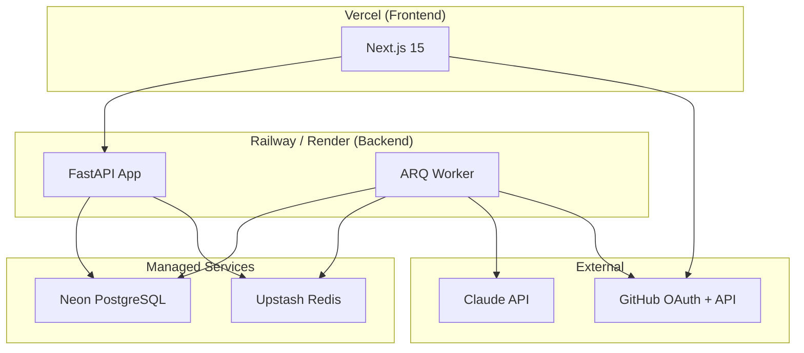

### Service Mapping

| Component | Service | Plan | Cost/mo |
|-----------|---------|------|---------|
| Frontend | Vercel | Hobby (Free) | $0 |
| Backend API | Railway | Starter ($5) | ~$5 |
| Worker | Railway (same) | Starter | included |
| PostgreSQL | Neon | Free tier (0.5 GB) | $0 |
| Redis | Upstash | Free tier (10K cmd/day) | $0 |
| Domain | Cloudflare | Free DNS | $12/yr |
| **Total MVP** | | | **~$5/mo** |

### Production Deployment (Post-MVP)

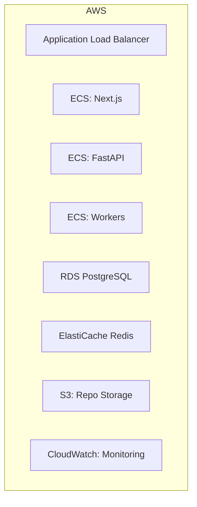

---

## 16. CI/CD Recommendations

### GitHub Actions Workflow

```yaml
# .github/workflows/ci.yml
name: CI

on:
  push:
    branches: [main]
  pull_request:
    branches: [main]

jobs:
  frontend:
    runs-on: ubuntu-latest
    defaults:
      run:
        working-directory: frontend
    steps:
      - uses: actions/checkout@v4
      - uses: actions/setup-node@v4
        with:
          node-version: 20
          cache: 'npm'
          cache-dependency-path: frontend/package-lock.json
      - run: npm ci
      - run: npm run lint
      - run: npm run type-check
      - run: npm run build

  backend:
    runs-on: ubuntu-latest
    defaults:
      run:
        working-directory: backend
    steps:
      - uses: actions/checkout@v4
      - uses: actions/setup-python@v5
        with:
          python-version: '3.12'
      - run: pip install -r requirements.txt
      - run: python -m pytest tests/ -v
      - run: python -m ruff check app/

  deploy:
    needs: [frontend, backend]
    if: github.ref == 'refs/heads/main'
    runs-on: ubuntu-latest
    steps:
      - uses: actions/checkout@v4
      # Deploy frontend to Vercel (auto via Vercel GitHub integration)
      # Deploy backend to Railway (auto via Railway GitHub integration)
```

### Deployment Strategy

| Stage | Trigger | Target |
|-------|---------|--------|
| **Dev** | Push to feature branch | Local Docker |
| **Preview** | PR opened | Vercel Preview + Railway Preview |
| **Production** | Merge to `main` | Vercel Prod + Railway Prod |

---

## 17. Security Best Practices

### MVP Security Checklist

| Area | Implementation | Priority |
|------|---------------|----------|
| **Auth** | GitHub OAuth (no password storage) | P0 |
| **Secrets** | Environment variables, never in code | P0 |
| **CORS** | Whitelist frontend domain only | P0 |
| **Rate Limiting** | `slowapi` on FastAPI (100 req/min) | P0 |
| **Input Validation** | Pydantic schemas on all endpoints | P0 |
| **SQL Injection** | SQLAlchemy ORM (parameterized queries) | P0 |
| **Token Storage** | Encrypted GitHub tokens in DB | P1 |
| **Repo Cloning** | Temp dir, auto-cleanup, size limits | P1 |
| **HTTPS** | Enforced via Vercel/Railway | P0 |
| **CSP Headers** | Next.js security headers | P1 |
| **Dependency Audit** | `npm audit` + `pip-audit` in CI | P1 |

### Sensitive Data Handling

```python
# backend/app/core/security.py
from cryptography.fernet import Fernet

class TokenEncryptor:
    def __init__(self, key: str):
        self.cipher = Fernet(key.encode())
    
    def encrypt(self, token: str) -> str:
        return self.cipher.encrypt(token.encode()).decode()
    
    def decrypt(self, encrypted: str) -> str:
        return self.cipher.decrypt(encrypted.encode()).decode()

# Encrypt GitHub access tokens before storing in DB
encryptor = TokenEncryptor(settings.ENCRYPTION_KEY)
encrypted_token = encryptor.encrypt(github_access_token)
```

---

## 18. Scalable MVP Roadmap

### Phase 1: Foundation (Week 1-2) — "Make It Work"

- [x] Project setup (monorepo, Docker, CI)
- [ ] GitHub OAuth authentication
- [ ] Database schema + migrations
- [ ] Basic API endpoints (projects CRUD)
- [ ] Repository cloning + file inventory
- [ ] Landing page + dashboard shell
- [ ] Project list + creation flow

### Phase 2: Core Analysis (Week 3-4) — "Make It Useful"

- [ ] Tree-sitter AST parsing (JS, TS, Python)
- [ ] Metric computation engine
- [ ] Technical debt detection rules
- [ ] Dependency analysis (npm, pip)
- [ ] Modernization scoring system
- [ ] Background job processing (ARQ)
- [ ] Analysis results dashboard UI

### Phase 3: AI Intelligence (Week 5-6) — "Make It Smart"

- [ ] Claude API integration
- [ ] AI-powered recommendations
- [ ] Refactoring suggestions with code diffs
- [ ] Repository structure visualization
- [ ] Hotspot detection
- [ ] Report generation + export (PDF/JSON)

### Phase 4: Polish & Demo (Week 7-8) — "Make It Wow"

- [ ] Animated score gauge component
- [ ] Radar chart for sub-scores
- [ ] Before/after code diff viewer
- [ ] Loading states + skeleton screens
- [ ] Error handling + edge cases
- [ ] Demo seed data (pre-analyzed repos)
- [ ] Landing page polish
- [ ] Performance optimization
- [ ] Deploy to production

### Post-MVP Features (Future)

| Feature | Value | Effort |
|---------|-------|--------|
| Multi-repo comparison | Compare scores across repos | Medium |
| Trend tracking | Score changes over time | Low |
| GitHub PR integration | Auto-analyze on PR | Medium |
| Team collaboration | Multi-user projects | Medium |
| Vector search (pgvector) | Semantic code search | Medium |
| Custom rule engine | User-defined debt rules | High |
| IDE extension | VS Code integration | High |
| SOC 2 compliance | Enterprise readiness | High |

---

## 19. Demo Strategy for Judges

### The 5-Minute Demo Script

> **Goal**: Show the complete journey from "repo URL" to "actionable modernization plan" in under 5 minutes.

#### Act 1: The Problem (30 seconds)
> "Engineering teams waste 40% of their time dealing with legacy code. We built CodeLens AI to change that."

#### Act 2: One-Click Analysis (90 seconds)
1. Sign in with GitHub (1-click)
2. Paste a repo URL (use a pre-seeded legacy repo)
3. Watch the real-time analysis progress bar
4. Show the **Modernization Readiness Score** — animated gauge going from 0 to the final score

#### Act 3: Deep Insights (90 seconds)
5. **Score breakdown** — radar chart showing sub-scores
6. **Technical debt** — sortable table of issues by severity
7. **Dependency risks** — highlight critical vulnerabilities
8. **File hotspots** — tree map showing problematic areas

#### Act 4: AI-Powered Actions (60 seconds)
9. **AI recommendations** — prioritized modernization steps
10. **Click "Refactor"** — show before/after code diff generated by AI
11. **One-click export** — download modernization report as PDF

#### Act 5: The Vision (30 seconds)
> "Every enterprise has legacy code. CodeLens AI turns weeks of manual assessment into minutes of automated intelligence."

### Demo Preparation

> [!IMPORTANT]
> Pre-seed 2-3 analyzed repositories before the demo to avoid live analysis wait times.

| Demo Repo | Language | Expected Score | Story |
|-----------|----------|---------------|-------|
| A React 16 app with no tests | JavaScript | D (32) | "Classic legacy frontend" |
| A Flask app with vulnerabilities | Python | F (18) | "Critical security debt" |
| A well-maintained Next.js app | TypeScript | B (71) | "Good but room for improvement" |

### Demo Technical Setup

```python
# scripts/seed.py
"""Pre-analyze demo repositories and seed results into the database"""

DEMO_REPOS = [
    {
        "name": "Legacy E-Commerce Frontend",
        "repo_url": "https://github.com/demo/legacy-react-app",
        "pre_analyzed": True,
        "score": 32,
        "grade": "D",
    },
    # ...
]
```

---

## 20. Step-by-Step Implementation Plan

### Week 1: Foundation Setup

| Day | Task | Details |
|-----|------|---------|
| **1** | Project scaffolding | Init Next.js 15, FastAPI, Docker Compose, Makefile |
| **1** | Database setup | PostgreSQL + Alembic migrations, initial schema |
| **2** | Auth flow | GitHub OAuth via Auth.js v5, user sync to backend |
| **2** | API skeleton | FastAPI routes, Pydantic schemas, CORS |
| **3** | Frontend shell | Dashboard layout, sidebar, shadcn/ui setup |
| **3** | Project CRUD | Create/list/delete projects (API + UI) |
| **4** | Repo cloning | Git clone service, file inventory builder |
| **5** | Job system | ARQ setup, job tracking, progress API |
| **5** | Integration test | End-to-end: create project → clone → store inventory |

### Week 2: Core Analysis Engine

| Day | Task | Details |
|-----|------|---------|
| **6** | tree-sitter setup | Install grammars (JS, TS, Python), parser service |
| **6** | Function extraction | Extract functions, classes, imports from AST |
| **7** | Metric computation | Complexity, LOC, nesting, params per function |
| **7** | Debt detection rules | Implement rule engine (15 initial rules) |
| **8** | File metrics API | Store + serve file-level metrics |
| **8** | Dep manifest parsing | Parse package.json, requirements.txt |
| **9** | Dep version checking | npm/PyPI registry lookups, version comparison |
| **9** | Vulnerability check | GitHub Advisory Database integration |
| **10** | Scoring system | Implement full scoring algorithm |
| **10** | Integration test | Full pipeline: clone → parse → metrics → score |

### Week 3: Dashboard UI

| Day | Task | Details |
|-----|------|---------|
| **11** | Score gauge component | Animated circular gauge with grade |
| **11** | Radar chart | Sub-score radar using Recharts |
| **12** | Project overview page | Score, stats cards, quick actions |
| **12** | Analysis page | Debt items table, severity filters |
| **13** | Dependency page | Dependency table, risk badges |
| **13** | File tree viz | Interactive repo structure tree |
| **14** | Job progress UI | Real-time progress bar with step labels |
| **14** | Loading/error states | Skeletons, error boundaries, empty states |
| **15** | Polish | Animations, responsive design, dark mode |

### Week 4: AI Intelligence

| Day | Task | Details |
|-----|------|---------|
| **16** | Claude API integration | API client, prompt templates, error handling |
| **16** | File-level AI analysis | Haiku batch analysis for semantic issues |
| **17** | Synthesis prompt | Sonnet for cross-repo recommendations |
| **17** | Recommendation storage | Store + serve AI recommendations |
| **18** | Recommendations UI | Cards with priority, category, effort |
| **18** | Refactoring endpoint | On-demand code refactoring via Claude |
| **19** | Code diff viewer | Before/after with syntax highlighting |
| **19** | Report generation | JSON + PDF export |
| **20** | End-to-end test | Full flow: sign in → add repo → view recommendations |

### Week 5-6: Polish & Scale (Optional)

| Task | Details |
|------|---------|
| Landing page design | Hero, features, social proof, CTA |
| Demo seed script | Pre-analyze 3 demo repos |
| Error recovery | Retry failed jobs, partial results |
| Performance | Optimize DB queries, add indexes, cache |
| Additional languages | Java, Go, Ruby support |
| Hotspot visualization | Treemap of file complexity |
| Mobile responsiveness | Dashboard responsive design |

### Week 7-8: Demo Prep

| Task | Details |
|------|---------|
| Production deployment | Vercel + Railway, custom domain |
| Demo script rehearsal | 5-minute walkthrough practice |
| Pitch deck | Problem, solution, demo, market, team |
| Edge case handling | Empty repos, huge repos, private repos |
| Analytics | Basic usage tracking |
| README + docs | Project documentation |

---

## User Review Required

> [!IMPORTANT]
> **Backend Language Decision**: This plan uses **FastAPI (Python)** as the backend because Python has superior tree-sitter bindings and AI/ML ecosystem. However, your tech stack mentions both Node.js and Python. Do you want to:
> - **(A) FastAPI (Python)** — Recommended for AST parsing + AI pipeline
> - **(B) Express.js (Node.js)** — If you prefer a single-language stack (JS/TS throughout)
> - **(C) Hybrid** — FastAPI for analysis workers, Express for REST API

> [!IMPORTANT]
> **Queue System**: This plan uses **ARQ** (lightweight Python async queue) instead of BullMQ. ARQ is simpler for a solo founder. If you strongly prefer BullMQ, we'd need a Node.js sidecar worker alongside the Python backend. Your preference?

> [!IMPORTANT]
> **AI Provider**: The plan assumes **Claude (Anthropic)** for AI analysis. Do you want to:
> - **(A) Claude only** — Haiku for bulk, Sonnet for synthesis
> - **(B) OpenAI only** — GPT-4o-mini for bulk, GPT-4o for synthesis
> - **(C) Provider-agnostic** — Abstract the AI layer to support both (slightly more work)

## Open Questions

> [!NOTE]
> 1. **Product Name**: I've used "CodeLens AI" as a working name. Do you have a preferred product name?
> 2. **Demo Repositories**: Do you have specific legacy repos you want to demo with, or should I create synthetic ones?
> 3. **Tailwind CSS Version**: You mentioned Tailwind CSS — do you want **v4** (latest, CSS-based config) or **v3** (stable, JS config)? shadcn/ui now defaults to v4.
> 4. **Deployment Priority**: Should we target Vercel + Railway (cheaper, faster setup) or go straight to AWS (more complex but enterprise-ready)?
> 5. **PDF Export**: For report export, should we use a simple HTML-to-PDF approach (`puppeteer`) or a templating library (`react-pdf`)?
